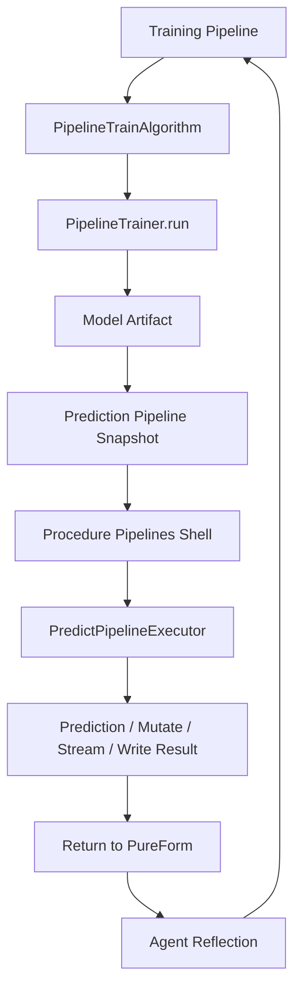
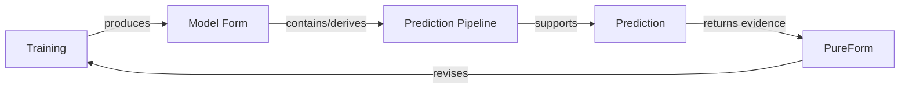
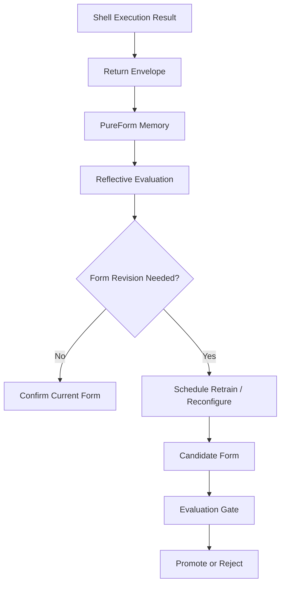
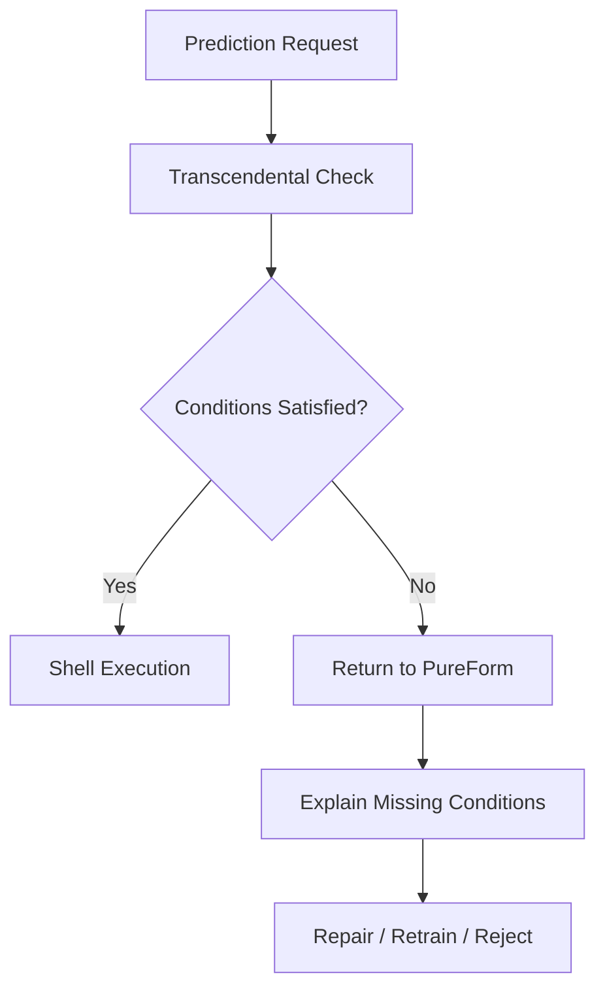
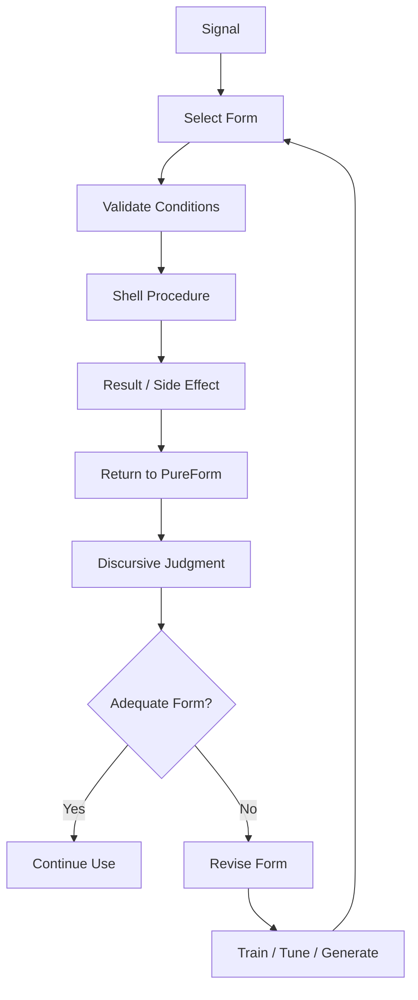

# Agent Mind Extension Spec

This note sketches how the current GDS pipeline architecture can expand into an Agent architecture: a Form/Shell system where trained models, prediction pipelines, graph procedures, GNNs, and reflective feedback loops become moments in a continual reasoning process.

The guiding idea is that the Agent does not merely run algorithms. It produces, uses, and revises forms of intelligibility. Training is the production of a model-form. Prediction is the use of that form in the Shell. Return to PureForm is the reflective moment where execution returns its results to the Agent's formal memory.

## 1) Architectural Thesis

The current pipeline split already contains the seed of an Agent mind:

- Training produces a model artifact from a training pipeline.
- The model carries a prediction pipeline derived from the training pipeline.
- Prediction procedures operationalize the model against a graph.
- Node-property steps allow supporting algorithms to mutate feature state before inference.
- Results can be returned as stream/mutate/write effects.

This is not merely an ML workflow. It is a structure of transcendental reasoning:

1. A form conditions possible cognition.
2. The Shell applies that form to a concrete graph world.
3. The result returns to PureForm as evidence, correction, or confirmation.
4. The Agent updates its future conditions of judgment and action.

## 2) Core Vocabulary

### Form

A Form is the intelligible structure that makes execution meaningful. In this architecture, Form includes:

- pipeline definitions
- feature steps
- node-property steps
- model metadata
- schema snapshots
- learned parameters
- evaluation statistics
- policy and promotion rules

A trained model is therefore not just weights or parameters. It is a preserved form of production: the training pipeline that produced it, the prediction pipeline that can use it, and the metadata that explains its validity.

### Shell

The Shell is the operational surface where Forms act on graph reality. Procedure facades, pipeline executors, mutate/write/stream modes, and graph stores all belong to the Shell.

The Shell should be deterministic, inspectable, and bounded. It applies a Form; it does not decide the whole meaning of the Form.

### PureForm

PureForm is the reflective register of the Agent. It stores the abstract structure of what has been learned and what must be reconsidered.

Return to PureForm is the phase where Shell execution becomes material for the Agent's next act of reasoning.

### Agential Discursive Logic

Agential Discursive Logic is the Agent's rule-governed movement between:

- representation
- judgment
- execution
- return
- revision

It is discursive because it reasons through explicit forms. It is agential because those forms guide action and are revised through consequences.

## 3) Existing Pipeline Architecture as Agent Seed

This loop is already latent in the current architecture. The missing piece is not the idea of retraining or prediction. The missing piece is the reflective controller that treats results as reasons for Form revision.

## 4) Train vs Predict as Production vs Use

Training and prediction are different modes of cognition.

Training is production:

- selects feature space
- performs model selection
- learns parameters
- records statistics
- emits a catalog model

Prediction is use:

- retrieves a trained model
- reconstructs the prediction pipeline
- computes required node properties
- extracts features
- performs inference
- returns or writes predictions

This distinction is important for Agent architecture. The Agent must know whether it is creating a new form or applying an existing form.

## 5) Return to PureForm Protocol

Return to PureForm should become an explicit protocol after Shell execution.

A Return should record:

1. Execution identity:
- procedure name
- graph name
- model name/version
- pipeline name/version
- execution mode

2. Formal context:
- graph schema snapshot
- feature properties used
- node-property steps executed
- model metadata
- config parameters

3. Result summary:
- predictions written or streamed
- metrics if labels/outcomes are available
- confidence/probability summaries when available
- warnings or validation failures

4. Reflective signal:
- drift indicators
- performance deltas
- schema changes
- retraining recommendations
- promotion/rollback recommendation

5. Traceability:
- timestamp
- user/session/agent id
- source model id
- previous champion model id
- decision log

## 6) GNN Integration Points

GNNs should enter as a new family within the same Form/Shell lifecycle, not as an unrelated subsystem.

### Training

Add GNN methods to the training method space:

- GraphSAGE
- GAT
- GCN
- message-passing variants
- link/node embedding methods

The training pipeline should be able to describe:

- graph neighborhood sampling
- message-passing depth
- feature encoders
- label/task head
- loss function
- evaluation metrics
- transductive vs inductive mode

### Prediction

Prediction should reuse the trained GNN Form:

- load model artifact
- reconstruct prediction pipeline
- compute required feature properties
- build sampled neighborhoods or full graph tensors
- run inference
- stream/mutate/write predictions

### Return

GNN predictions should return richer reflective signals:

- embedding drift
- neighborhood distribution drift
- feature attribution summaries
- prediction confidence shifts
- out-of-distribution node/edge patterns

## 7) Transcendental Reasoning Layer

The transcendental layer asks: what must be true for this prediction, model, or action to be valid?

For each model use, the Agent should be able to inspect:

- What graph schema does this Form presuppose?
- What features must exist or be generated?
- What training distribution does this Form remember?
- What metric made this Form acceptable?
- What execution mode is being requested?
- What would count as failure, drift, or contradiction?

This layer is transcendental because it governs conditions of possible valid inference, not merely outputs.

## 8) Agential Discursive Control Loop

The Agent's reasoning cycle can be modeled as:

1. Receive task or environment signal.
2. Select relevant Form.
3. Validate transcendental conditions.
4. Execute through Shell.
5. Receive Return to PureForm.
6. Judge whether the Form remains adequate.
7. Confirm, revise, retrain, or replace.

## 9) Implementation Roadmap

### Phase 1: Documentation and Mapping

- Map train execution paths.
- Map predict execution paths.
- Map ProcedureExecutor boundaries.
- Map model catalog and prediction pipeline derivation.

### Phase 2: Return Envelope

Define a ReturnToPureForm record with:

- identity
- formal context
- result summary
- reflective signals
- trace metadata

Start as a passive log object before making it control behavior.

### Phase 3: Reflection Service

Introduce a service that consumes Return envelopes and produces judgments:

- accept
- warn
- retrain
- reject
- promote candidate
- rollback

### Phase 4: GNN Pipeline Family

Add GNNs as training/prediction families inside the existing pipeline lifecycle.

Do not bypass the Form/Shell split. GNNs should produce model Forms and prediction pipelines just like regression/classification.

### Phase 5: Agent Controller

Add an Agent-level controller that coordinates:

- Form selection
- Shell invocation
- Return interpretation
- continual retraining policy
- model promotion and rollback

## 10) Design Constraints

1. Shell procedures should remain deterministic and inspectable.
2. Reflection should be explicit, not hidden inside prediction calls.
3. Models should carry enough pipeline metadata to reproduce prediction conditions.
4. GNN expansion should reuse the pipeline lifecycle where possible.
5. Return to PureForm should begin as observation before becoming automation.
6. Promotion should require evaluation gates, not merely successful training.

## 11) Practical Code Anchors

- Pipeline training template: `gds/src/projection/eval/pipeline/pipeline_train_algorithm.rs`
- Predict pipeline template: `gds/src/projection/eval/pipeline/predict_pipeline_executor.rs`
- Node predict pipeline snapshot: `gds/src/projection/eval/pipeline/node_pipeline/node_property_predict_pipeline.rs`
- Node classification prediction executor: `gds/src/procedures/pipelines/node_classification_predict_pipeline_executor.rs`
- Node regression prediction executor: `gds/src/procedures/pipelines/node_regression_predict_pipeline_executor.rs`
- Node-property algorithm hook: `gds/src/projection/eval/pipeline/node_property_step_execution.rs`
- Generic procedure executor: `gds/src/projection/eval/algorithm/executor.rs`
- Existing mental model: `gds/doc/PIPELINE_EXECUTION_MENTAL_MODEL.md`

## 12) Summary

The emerging architecture is not merely a graph ML pipeline system. It is a candidate Agent mind architecture.

Training produces Forms. Prediction uses Forms. Shell procedures enact Forms. Return to PureForm reflects execution back into the Agent's formal memory. Agential Discursive Logic is the controller that judges whether a Form remains adequate, must be revised, or should be replaced.

GNNs should be added as a deeper model family within this same loop. Continual learning then becomes not an external add-on, but the natural movement of the Agent: from Form, through Shell, into Return, and back to Form.
