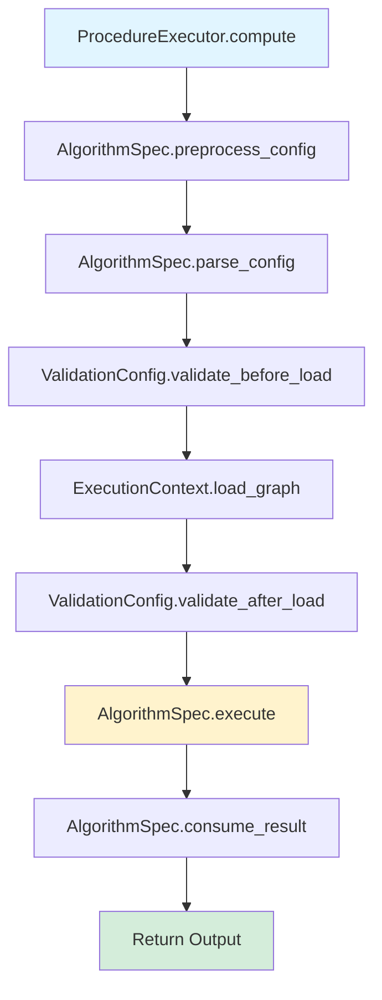
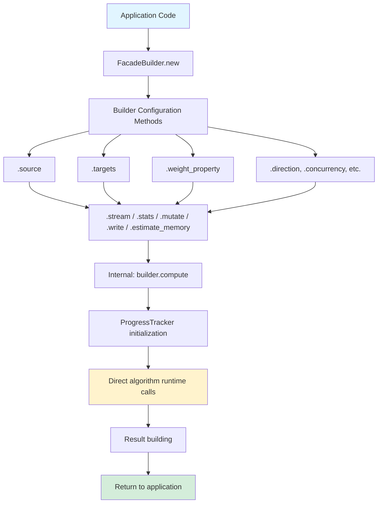

# Architecture: Three Execution Paradigms

## Permanent Architecture Decision

This architecture is the **permanent design** for the platform. The three execution paradigms serve distinct purposes and will be maintained and developed going forward. Each paradigm is optimized for its specific use case and should not be forced to unify with the others.

## Overview

The platform provides three distinct ways to execute graph algorithms:

1. **Procedure Executor (spec.rs)** - Declarative execution with full lifecycle orchestration
2. **Facades (Builder Pattern)** - Direct application execution with imperative control
3. **Applications Forms (Web/NAPI JSON API)** - User-facing JSON interface

All three paradigms share the same underlying algorithm runtimes (`ComputationRuntime`, `StorageRuntime`), ensuring consistent algorithm behavior regardless of execution path.

---

## 1. Procedure Executor (spec.rs) - Codegen/Declarative Execution

**Location**: `gds/src/procedures/{algo}/spec.rs`  
**Runtime**: `gds/src/projection/eval/procedure/executor.rs`  
**Purpose**: Procedure generators, codegen workflows, full lifecycle orchestration

### Control Flow



### Characteristics

- **Uses `define_algorithm_spec!` macro** to generate `AlgorithmSpec` implementations
- **Declarative**: Algorithm defines config struct, validation, execution modes
- **Full lifecycle orchestration**: Config preprocessing, two-phase validation, graph loading
- **Designed for**: Procedure generators and codegen workflows
- **Example**: `gds/src/procedures/astar/spec.rs` generates `ASTARAlgorithmSpec`

### Key Components

- **AlgorithmSpec trait**: Contract that algorithms must implement
- **ProcedureExecutor**: Orchestrates the complete execution lifecycle
- **ValidationConfiguration**: Two-phase validation (before/after graph load)
- **ExecutionContext**: Provides graph catalog, logging, metrics

### When to Use

Use Procedure Executor when:
- Building procedure generators
- Codegen workflows
- Need full lifecycle orchestration
- Complex validation requirements
- Want declarative algorithm definition

---

## 2. Facades (Builder Pattern) - Direct Application Execution

**Location**: `gds/src/procedures/facades/pathfinding/{algo}.rs`  
**Purpose**: Direct application calls, simple imperative execution

### Control Flow



### Characteristics

- **Fluent builder API** for direct application use
- **Bypasses ProcedureExecutor** entirely
- **Direct calls** to algorithm runtimes (`ComputationRuntime`, `StorageRuntime`)
- **Simpler control flow**: parse → build → execute → return
- **Includes memory estimation** (`estimate_memory()`)
- **Progress tracking** initialized (ready for full integration)

### Key Components

- **FacadeBuilder**: Fluent builder for algorithm configuration
- **Algorithm Runtimes**: Direct access to `ComputationRuntime` and `StorageRuntime`
- **ProgressTracker**: Progress tracking infrastructure
- **Memory Estimation**: `estimate_memory()` method for resource planning

### When to Use

Use Facades when:
- Direct application calls
- Simple, direct execution
- Want full control over execution
- Building applications that call algorithms directly
- Need memory estimation and progress tracking

---

## 3. Applications Forms (Web/NAPI JSON API) - User-Facing Interface

**Location**: `gds/src/applications/algorithms/pathfinding/{algo}.rs`  
**Purpose**: Web/NAPI invocations via "Applications Forms" - user-facing JSON API

**Key Capability**: Applications Forms can call:
- **Procedures** (via spec.rs / AlgorithmSpec)
- **Pipelines** (as Graph Algorithms - future)
- **Projection Native Factory** directly (e.g., `ArrowNativeFactory` via `project_native` operation)

### Control Flow

```mermaid
flowchart TD
    Start[Web/NAPI JSON Request] --> Handler[handle_{algo}]
    Handler --> Parse[Parse JSON parameters]
    Parse --> GraphName[Extract graphName]
    Parse --> Source[Extract sourceNode]
    Parse --> Targets[Extract targetNode/targetNodes]
    Parse --> Mode[Extract mode]
    Parse --> Other[Extract other params]
    
    GraphName --> Catalog[Get graph store from catalog]
    Catalog --> CreateBuilder[Create facade builder]
    
    Source --> Configure
    Targets --> Configure
    Other --> Configure
    
    Configure[Configure builder] --> MatchMode{Match mode}
    
    MatchMode -->|"stream"| Stream[builder.stream]
    MatchMode -->|"stats"| Stats[builder.stats]
    MatchMode -->|"mutate"| Mutate[builder.mutate]
    MatchMode -->|"write"| Write[builder.write]
    MatchMode -->|"estimate"| Estimate[builder.estimate_memory]
    
    Stream --> Response
    Stats --> Response
    Mutate --> Response
    Write --> Response
    Estimate --> Response
    
    Response[Return JSON response] --> End[Web/NAPI Response]
    
    style Start fill:#e1f5ff
    style End fill:#d4edda
    style MatchMode fill:#fff3cd
```

### Characteristics

- **User-facing JSON API** for Web/NAPI invocations
- **"Applications Forms"** - standardized request/response format
- **Delegates to facades** (bypasses spec.rs/executor) for algorithms
- **Direct Projection Factory access** - can call `ArrowNativeFactory` and other factories directly
- **Simple parameter parsing** and mode routing
- **Returns JSON responses**
- **TypeScript agents** can call into the Projection engine directly from the TS layer

### Key Components

- **Applications Forms**: Standardized JSON request/response format
- **Handler Functions**: `handle_{algo}(request, catalog)` pattern for algorithms
- **Projection Handlers**: `project_native` operation for direct factory access
- **Graph Catalog**: Provides graph stores by name
- **Mode Routing**: Routes to appropriate facade method based on `mode` parameter
- **Native Factory Access**: Direct access to `ArrowNativeFactory` and other projection factories

### When to Use

Use Applications Forms when:
- Building Web/NAPI interfaces
- User-facing JSON APIs
- Simple parameter parsing needed
- Standardized request/response format required
- **TypeScript agents** need to call Procedures, Pipelines, or Projection Native Factory
- Need direct access to graph projection from native data sources (Arrow, Polars, etc.)

---

## Architectural Relationships

### Is spec.rs a Facade?

**No** - spec.rs and facades serve different purposes:

- **spec.rs**: Implements `AlgorithmSpec` trait for `ProcedureExecutor` orchestration
  - Declarative execution with full lifecycle management
  - Config preprocessing, validation, graph loading handled by executor
  - Designed for codegen/procedure generators
  
- **facades**: Direct builder API for applications
  - Imperative execution with manual control
  - Applications handle their own graph loading, validation
  - Designed for direct application integration

### Shared Runtimes

Both paradigms use the same underlying algorithm runtimes:

```
┌─────────────────────────────────────────┐
│  Algorithm Runtimes (Shared)            │
│  - ComputationRuntime                   │
│  - StorageRuntime                       │
└─────────────────────────────────────────┘
           ▲                    ▲
           │                    │
    ┌──────┴──────┐    ┌────────┴────────┐
    │             │    │                 │
┌───┴──────────┐  │    │  ┌──────────────┴──┐
│ Procedure    │  │    │  │ Facades          │
│ Executor     │  │    │  │ (Builder)        │
│ (spec.rs)    │  │    │  │                  │
└──────────────┘  │    │  └──────────────────┘
                  │    │
                  │    └───► Applications Forms
                  │          (JSON API)
                  │
                  └──────────► Direct Application Calls
```

---

## Decision Guide: When to Use Which Paradigm

### Use Procedure Executor (spec.rs) when:

✅ Building procedure generators  
✅ Codegen workflows  
✅ Need full lifecycle orchestration  
✅ Complex validation requirements  
✅ Want declarative algorithm definition  
✅ Need automatic config preprocessing  
✅ Want two-phase validation (before/after graph load)

### Use Facades when:

✅ Direct application calls  
✅ Simple, direct execution  
✅ Want full control over execution  
✅ Building applications that call algorithms directly  
✅ Need memory estimation (`estimate_memory()`)  
✅ Need progress tracking  
✅ Want to bypass executor overhead

### Use Applications Forms when:

✅ Building Web/NAPI interfaces  
✅ User-facing JSON APIs  
✅ Simple parameter parsing needed  
✅ Standardized request/response format required  
✅ Need to expose algorithms via HTTP/NAPI  
✅ Want simple JSON-based interface

---

## Terminology

### Standard Terms

- **"spec.rs"**: AlgorithmSpec implementation for `ProcedureExecutor`
  - **Planned shape** (not broadly used in the repo yet)
  - The current codebase mostly uses direct facades/builders instead of `ProcedureExecutor`

- **"facades"**: Direct builder API for applications
  - Located in `gds/src/procedures/{category}/{algo}.rs`
  - Provides fluent builder pattern
  - Used for direct application integration

- **"Applications Forms"**: Web/NAPI JSON API layer
  - Located in `gds/src/applications/algorithms/{category}/{algo}.rs`
  - Provides JSON request/response interface
  - Delegates to facades

### Related Terms

- **Algorithm Runtimes**: Shared computation and storage runtimes used by all paradigms
- **Procedure Executor**: Orchestrator for spec.rs-based execution
- **Graph Catalog**: Registry of graph stores accessible by name
- **Execution Modes**: stream, stats, mutate, write, estimate

---

## Integration Points

### Applications Forms → Facades → Algorithm Runtimes

```
JSON Request
  ↓
Applications Form Handler
  ↓
Facade Builder
  ↓
Algorithm Runtimes (ComputationRuntime, StorageRuntime)
  ↓
Result
  ↓
JSON Response
```

### Applications Forms → Projection Native Factory

```
JSON Request (project_native)
  ↓
NativeProjectApplication Handler
  ↓
ArrowNativeFactory / Other Factories
  ↓
GraphStore Creation
  ↓
Graph Catalog Storage
  ↓
JSON Response
```

**Key Point**: TypeScript agents can call the Projection Native Factory directly through Applications Forms, enabling direct graph creation from Arrow tables, Polars DataFrames, or other native data sources without going through Procedures or Pipelines.

### Procedure Executor → AlgorithmSpec → Algorithm Runtimes

```
ProcedureExecutor.compute()
  ↓
AlgorithmSpec (from spec.rs)
  ↓
Algorithm Runtimes (ComputationRuntime, StorageRuntime)
  ↓
ComputationResult
  ↓
AlgorithmSpec.consume_result()
  ↓
Output
```

### Progress Tracking Integration

- **Facades**: ProgressTracker initialized in `compute()` methods
- **Procedure Executor**: Progress tracking via ExecutionContext (future)
- **Applications Forms**: Progress tracking available through facades

### Memory Estimation Integration

- **Facades**: `estimate_memory()` method available on all builders
- **Applications Forms**: Exposed via `"estimate"` mode
- **Procedure Executor**: Memory estimation via ExecutionContext (future)

---

## Key Architectural Principles

1. **Separation of Concerns**: Each paradigm serves distinct use cases
2. **No Forced Unification**: Keep paradigms separate, don't force one to use the other
3. **Shared Runtimes**: Both paradigms use same algorithm runtimes (ComputationRuntime, StorageRuntime)
4. **Progressive Enhancement**: Facades can add features (memory estimation, progress tracking) without affecting spec.rs
5. **Applications Forms**: Simple, user-friendly JSON API that delegates to facades

---

## Questions Resolved

1. ✅ **Should we keep both paradigms?** Yes - permanent architecture
2. ✅ **Is duplication intentional?** Yes - different execution paradigms
3. ✅ **Should applications use spec.rs?** No - applications use facades directly
4. ✅ **How to integrate progress/memory?** In facades (already started)

---

## Examples

### Procedure Executor Example

```rust
use gds::projection::eval::procedure::*;

let mut executor = ProcedureExecutor::new(context, ExecutionMode::Stream);
let mut algorithm = ASTARAlgorithmSpec::new("my_graph".to_string());
let config = json!({
    "source_node": 0,
    "target_node": 100,
    "latitude_property": "lat",
    "longitude_property": "lon"
});
let result = executor.compute(&mut algorithm, &config)?;
```

### Facade Example

```rust
use gds::procedures::pathfinding::AStarBuilder;

let builder = AStarBuilder::new(graph_store)
    .source(0)
    .target(100)
    .weight_property("cost")
    .heuristic(Heuristic::Euclidean);

let paths: Vec<_> = builder.stream()?.collect();
```

### Applications Form Example (Algorithm)

```json
{
  "facade": "algorithms",
  "op": "dijkstra",
  "graphName": "my_graph",
  "sourceNode": 0,
  "targetNode": 100,
  "weightProperty": "cost",
  "mode": "stream"
}
```

### Applications Form Example (Projection Native Factory)

```json
{
  "facade": "graph_store_catalog",
  "op": "project_native",
  "graphName": "my_projected_graph",
  "projectionConfig": {
    "sourceGraphName": "source_graph",
    "nodeLabels": ["Person", "Company"],
    "relationshipTypes": ["KNOWS", "WORKS_FOR"]
  }
}
```

**Note**: The Projection Native Factory can be called directly from TypeScript agents, enabling direct graph creation from native data sources (Arrow, Polars, etc.) through the same Applications Forms JSON API.

---

## Future Enhancements

- **Progress Tracking**: Full integration in Procedure Executor
- **Memory Estimation**: Integration in Procedure Executor
- **Unified Error Handling**: Consistent error types across paradigms
- **Performance Monitoring**: Metrics collection across all paradigms

