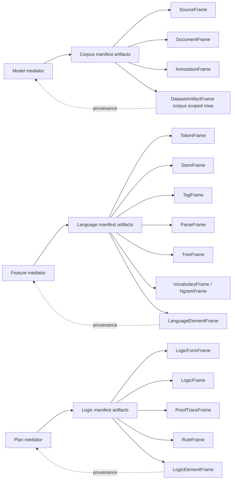

# Pipeline Artifact DataFrames

## Purpose

This note records the key dataframe-shaped persistence targets for the Dataset pipeline now that `Model`, `Feature`, and `Plan` are being treated as mediators rather than as final outputs. The DataFrame remains a storage and inspection substrate, but the real artifacts are the manifest objects it can persist or summarize.

## Guiding Rule

- `Model`, `Feature`, and `Plan` are mediator layers.
- Their productions are manifest artifacts:
  - `Model -> Corpus`
  - `Feature -> Language`
  - `Plan -> Logic`
- DataFrames are the persistence/shaping layer for those artifacts, not the conceptual center.

## Ownership Boundary

- Artifacts are persisted as Dataset-level objects.
- Corpus is larger than a single artifact: it is the evidentiary aggregate
  (sources, documents, annotations, and working dataset views).
- Therefore, a model does not map to one corpus artifact directly; it contributes
  to Dataset artifact sets that may be grouped, indexed, and served through Corpus.

## Guide Diagram

This is the working picture to use when filling in the missing details.

## Core DataFrame Families

### 1. Corpus persistence frames

These frames preserve evidentiary material and the paths that led to it.

- `SourceFrame`
  - content hashes, URIs, MIME types, sizes
  - persistent identity for source material
- `DocumentFrame`
  - document rows, source binding, offsets, spans, document-level metadata
- `AnnotationFrame`
  - annotation records grouped by layer / annotator / guideline version
- `DatasetArtifactFrame` (proposed, corpus-scoped)
  - dataset-level artifact rows for corpus selections, evidence bundles, and derived views
  - provenance back to `Model` mediators

### 2. Language persistence frames

These frames preserve realized language elements produced from feature mediation.

- `TokenFrame`
  - token strings, offsets, spans, sentence membership
- `StemFrame`
  - stemmed forms and stem provenance
- `TagFrame`
  - part-of-speech and related tag sequences
- `ParseFrame`
  - parse forests, dependency structures, and parse outcomes
- `TreeFrame`
  - tree-shaped linguistic structures
- `VocabularyFrame` / `NgramFrame` (existing LM-facing candidates)
  - lexical inventory, counts, and context statistics
- `LanguageElementFrame` (proposed)
  - manifest rows for token/construction/relation/rule/usage forms
  - provenance back to `Feature` mediators

### 3. Logic persistence frames

These frames preserve inferential forms produced from plan mediation.

- `LogicFormFrame`
  - logic forms, source strings, parse results, error state
- `LogicFrame`
  - returned logic artifacts and organized semantic forms
- `ProofTraceFrame` (proposed)
  - proof steps, derivation traces, validation checkpoints
- `RuleFrame` (proposed)
  - normalized logic rules and transformation records
- `LogicElementFrame` (proposed)
  - manifest rows for rule / entailment / proof-trace / validity / transformation forms
  - provenance back to `Plan` mediators

## Current Runtime-Backed Artifact Targets

These are already present or close to present in the codebase.

- `OntologyDataFrameImageTables`
  - `models`
  - `features`
  - `constraints`
  - `queries`
  - `provenance`
- `Corpus` frames
  - source, document, annotation, working text dataset
- `LanguageModel` internal state
  - vocabulary, n-gram counters, context counts
- `LogicForm` / `LogicFrame`
  - semantic form records and returned logic surface

## Minimal Persistence Map

If the goal is to persist the pipeline artifacts cleanly, the lowest-friction map is:

- corpus evidence -> `SourceFrame` + `DocumentFrame` + `AnnotationFrame`
- corpus-derived selections -> `DatasetArtifactFrame` (corpus-scoped)
- language realizations -> `TokenFrame` / `TagFrame` / `ParseFrame` / `LanguageElementFrame`
- logic realizations -> `LogicFormFrame` / `LogicFrame` / `LogicElementFrame`

## Notes

- DataFrame persistence is a useful image, but not the definition of the artifact.
- Each manifest frame should carry mediator provenance so the artifact can answer:
  - where it came from,
  - which mediator produced it,
  - and which manifestation kind it belongs to.
- This note is intentionally incomplete on purpose. It is a working target list, not a final ontology.

## Suggested Next Reading

- `gds/doc/DATASET-SEMANTIC-MODEL-BUILDER-DOCTRINE.md`
- `gds/doc/PIPELINE_EXECUTION_MENTAL_MODEL.md`
- `gds/src/collections/dataset/corpus/manifest.rs`
- `gds/src/collections/dataset/language/manifest.rs`
- `gds/src/collections/dataset/logic/manifest.rs`
