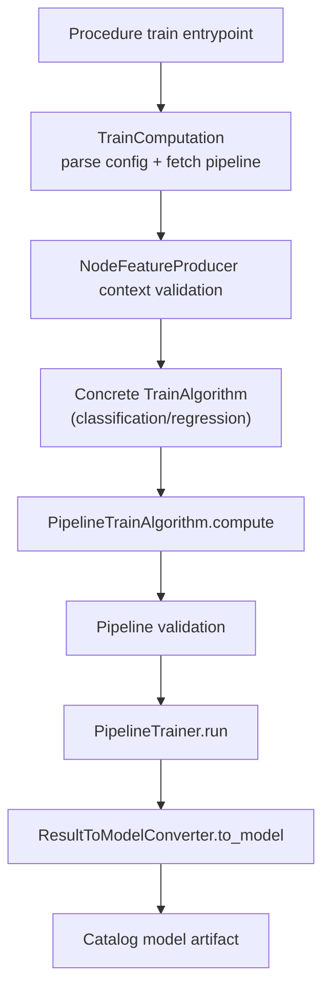
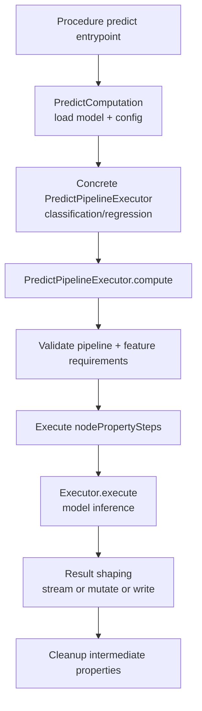
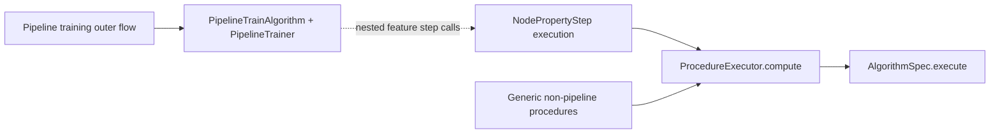
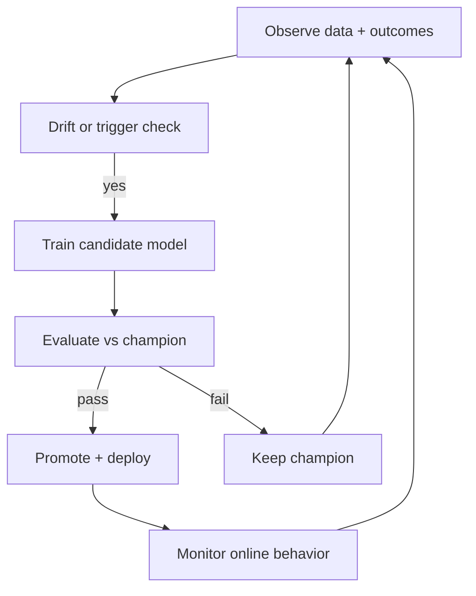

# Pipeline Execution Mental Model

A compact map of how training and prediction work in this codebase, where ProcedureExecutor is used, and what is needed for continual-learning loops.

## Terminology Guardrail

- Pipeline is the ML execution carrier (training or prediction orchestration).
- Plan is the semantic commitment layer (dataset semantics, form commitments, provenance-bearing intent).
- This document is runtime-engineering focused: it describes Pipeline behavior, not Plan semantics.
- When both appear in architecture discussions, treat Pipeline as one implementation surface that may execute parts of a Plan, but never as a synonym for Plan.

## 1) Train Execution Path

Training is model production. The orchestrator is PipelineTrainAlgorithm plus a concrete PipelineTrainer implementation.

Key idea:
- Training path is specialized pipeline orchestration, not the generic AlgorithmSpec runtime.

## 2) Predict Execution Path

Prediction is model use. Predict executors run node-property feature steps, then inference, then output as stream/mutate/write shape.

Key idea:
- Predict path is where model artifacts become operational outputs.

## 3) ProcedureExecutor Boundary

ProcedureExecutor appears in two important places:
- Generic AlgorithmSpec runtime.
- Nested inside pipeline node-property steps.

It is not the top-level orchestrator for pipeline training in the current architecture.

Key idea:
- ProcedureExecutor is a shared execution kernel, but pipeline training has its own outer controller.

## 4) Continual-Learning Prerequisites

This architecture supports iterative retrain-and-serve loops, but production continual learning needs explicit control logic:

1. Data/change detection:
- Detect distribution drift, schema drift, and label freshness windows.

2. Retraining policy:
- Trigger rules (time-based, data-volume-based, performance-based).
- Training budget limits and concurrency limits.

3. Evaluation gate:
- Holdout evaluation against current champion model.
- Regression/classification metric thresholds and fail-fast criteria.

4. Model lifecycle:
- Versioning, promotion rules, rollback, and retention policy.

5. Safe deployment:
- Canary predict runs, shadow evaluation, and post-deploy monitoring.

6. Feedback loop:
- Capture outcomes for the next training cycle and audit traces.

## Practical Reading Order

1. gds/src/projection/eval/pipeline/pipeline_train_algorithm.rs
2. gds/src/procedures/pipelines/node_classification_train_computation.rs
3. gds/src/procedures/pipelines/node_regression_train_computation.rs
4. gds/src/projection/eval/pipeline/predict_pipeline_executor.rs
5. gds/src/procedures/pipelines/node_classification_predict_pipeline_executor.rs
6. gds/src/procedures/pipelines/node_regression_predict_pipeline_executor.rs
7. gds/src/projection/eval/pipeline/node_property_step_execution.rs
8. gds/src/projection/eval/algorithm/executor.rs
